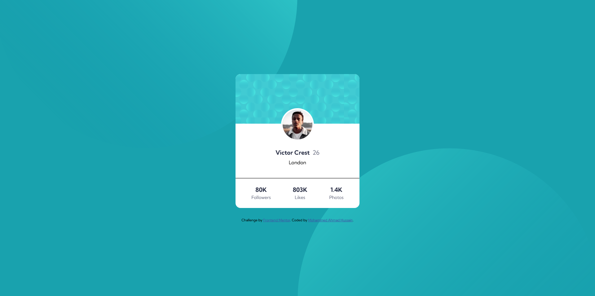

# Frontend Mentor - Profile card component solution

This is a solution to the [Profile card component challenge on Frontend Mentor](https://www.frontendmentor.io/challenges/profile-card-component-cfArpWshJ). Frontend Mentor challenges help you improve your coding skills by building realistic projects.

## Table of contents

- [The challenge](#the-challenge)
- [Screenshot](#screenshot)
- [Links](#links)
- [My process](#my-process)
  - [Built with](#built-with)
  - [What I learned](#what-i-learned)
- [Author](#author)
- [Acknowledgments](#acknowledgments)

### The challenge

- Build out the project to the designs provided

### Screenshot

### Links

- Solution URL: [https://github.com/mah07308/FM-Profile-Card-Component](https://github.com/mah07308/FM-Profile-Card-Component)
- Live Site URL: [https://mah07308.github.io/FM-Profile-Card-Component/](https://mah07308.github.io/FM-Profile-Card-Component/)

## My process

I used HTML5, CSS, and flexbox to complete this project. I had initially used absolute positioning to center the card and floats to align the statistics. Then switched to flexbox.

Used ::before and ::after along with absolute positioning to position the background images relative to the profile card.

### Built with

- Semantic HTML5 markup
- CSS
- Flexbox

### What I learned

Fixing the background images so that they do not move when resizing the browser window using ::before and ::after selectors and absolute positioning.

## Author

- Frontend Mentor - [@mah07308](https://www.frontendmentor.io/profile/mah07308)

## Acknowledgments

I thank @Grace-Snow and @Vanza for providing valuable feedback and resources which improved my knowledge and helped in completing the challenge.
